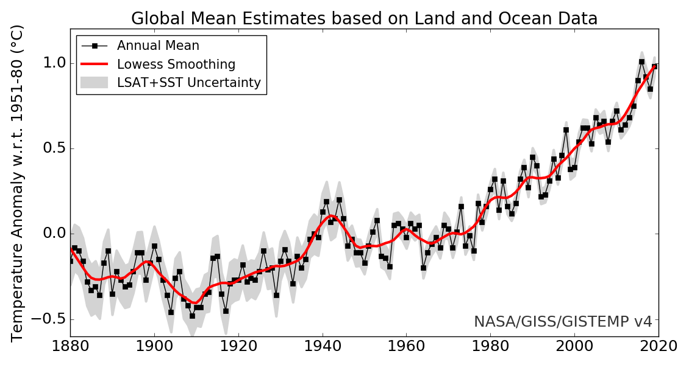
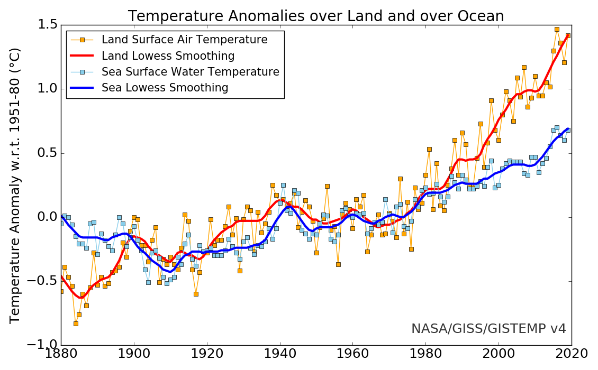
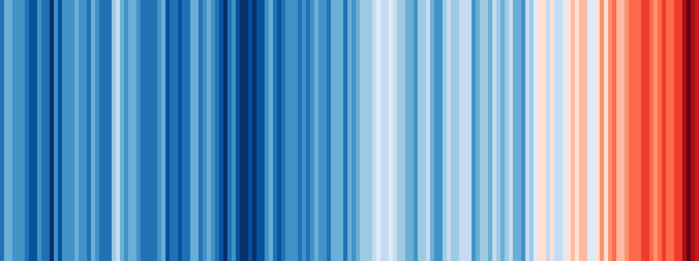

- [Einführung](#einführung)
- [Softwareübersich 🤯 `Python` / `Matplotlib` / `Jupyter Notebook` / `JupyterHub` / `JupyterLab`](#softwareübersich--python--matplotlib--jupyter-notebook--jupyterhub--jupyterlab)
  - [Was ist ein `**Jupyter Notebook**` ?](#was-ist-ein-jupyter-notebook-)
    - [1️⃣ `**Jupyter Notebooks` lokal auf dem eigenen Rechner\*\*](#1️⃣-jupyter-notebooks-lokal-auf-dem-eigenen-rechner)
    - [2️⃣ `**JupyterHub**` **der HTWK-Leipzig (Fakultät IM) verwenden (Webzugang)**](#2️⃣-jupyterhub-der-htwk-leipzig-fakultät-im-verwenden-webzugang)
  - [JuptyerHub](#juptyerhub)
  - [JupyterLab](#jupyterlab)

# Einführung

> “In school we learn a lot about language and math. On the language side we learn how to put words together into sentences and stories. With math, we learn to make sense of numbers. But it’s rare that these two sides are paired. No one tells us how to tell stories with numbers … this leaves us poorly prepared for an important task that is increasingly in demand.” – Cole Nussbaumer Knaflic

In diesem Kurs geht es darum **Daten** (z.B. aus Experiment/Simulation/Berechnung) zu **visualisieren.** Die Visualisierung dient dabei immer dem Zweck eine bestimmte **Frage zu beantworten**. Diese könnte zum Beispiel sein:

Wie groß ist die **jährliche Veränderung** der **Temperatur** der **erdnahen Atmosphäre** **und der Meere seit Beginn der Industrialisierung**?

[[von NASA](https://data.giss.nasa.gov/gistemp/graphs_v4/)] Land-ocean temperature index, 1880 to present, with base period 1951-1980. The solid black line is the global annual mean and the solid red line is the five-year lowess smooth. The gray shading represents the total (LSAT and SST) annual uncertainty at a 95% confidence interval and is available for [download](https://data.giss.nasa.gov/gistemp/graphs_v4/graph_data/totalCI_ERA.csv). [More information on the updated uncertainty model can be found here: [Lenssen et al. (2019)](https://pubs.giss.nasa.gov/abs/le05800h.html).]

**LSAT** = **L**and **S**urface **A**ir **T**emperature
**SST** = **S**ea **S**urface **T**emperature

**Eine gute Datenvisualisierung muss zusammen mit der Bildunterschrift folgende Kriterien erfüllen:**

✅ **lesbar / erkennbar**

- **Schriftgröße ausreichend groß** und Schriftart lesbar
- **Farben** und **Kontrast** hinsichtlich Unterscheidung von Kategorien und Lesbarkeit für Farbblinde geeignet
- **Linientypen** und **Liniendicke** hinsichtlich Unterscheidung von Kategorien und Lesbarkeit geeignet
- ggf. wichtige Daten als Text in die Abbildung einbringen

✅ **verständlich**

- **Achsenbeschriftung mit Einheiten** vorhanden und eindeutig
- Verwendung von **Legenden** und/oder **zusätzlichem Textelementen um Daten eindeutig zu kennzeichnen**
- **Aussage der Datenvisualisierung** muss zusammen **mit Bildunterschrift und Titel** (wenn vorhanden) **ohne zusätzlichen Kontext ersichtlich** sein

✅ **übersichtlich**

- Wenn nicht zwingend notwendig, **nicht zu viele Variationen in eine Datenvisualisierung**, ggf. lieber mehrere Abbildungen erstellen

**Nehmen wir nun erneut NASA Daten diesmal mit der Unterscheidung nach Land und Ozean und prüfen nach unseren Kriterien:**

[[von NASA](https://data.giss.nasa.gov/gistemp/graphs_v4/)] Annual (thin lines) and five-year lowess smooth (thick lines) for the temperature anomalies (vs. 1951-1980) averaged over the Earth’s land area and sea surface temperature anomalies (vs. 1951-1980) averaged over the part of the ocean that is free of ice at all times (open ocean).

**Anmerkungen**:

- 👍 Temperaturen der Ozeane mit blauer Farbe macht die Unterscheidung intuitiv einfach
- 👍 [Auf der Webseite](https://data.giss.nasa.gov/gistemp/graphs_v4/#) können Datenpunkte interaktiv abgelesen werden
- 👍 Datenpunkte zu jedem Jahr mit niedrigerer Farbintensität und Linienstärke im Vergleich zum 5-Jahres-Mittelwert, da Mittelwert die bessere Aussagekraft hat und dies somit besser hervorsteht
- 👍 Im Vergleich zur oberen Abbildung wurde auf das Konfidenzintervall verzichtet, weil dies die Grafik ggf. sehr unübersichtlich gemacht hätte

Eine der **simpelsten** und **gleichzeitig effektivsten Formen der Datenvisualisierung** hat der Klimatologe Ed Hawkins mit den sogenannten **[Warming Stripes (Klimastreifen)](http://www.climate-lab-book.ac.uk/2018/2018-visualisation-update/)** aufgezeigt**.** Er wollte den rapiden Temperaturanstieg der letzten Jahre veranschaulichen und hat die oben gezeigten Daten Farbcodiert.

[[Ed Hawkins](http://www.climate-lab-book.ac.uk/2018/2018-visualisation-update/)] Warming stripes for 1850-2018 using the WMO annual global temperature dataset.

Neben der eher unwissenschaftlichen Darstellung mit den Climate Stripes hat Hawkins auch weitere Darstellungen erzeugt, die definitiv ein Beispiel für eine sehr gelungene Datenvisualisierung sind:

[[Ed Hawkins](http://www.climate-lab-book.ac.uk/2018/2018-visualisation-update/)] Climate spiral for the WMO global temperature dataset.

[[Ed Hawkins](http://www.climate-lab-book.ac.uk/2018/2018-visualisation-update/)] Arctic sea ice concentration from NSIDC for Septembers during 1979-2018.

Hawkins hat seine Klimastreifen mit [Daten des PAGES2k Team](https://www.nature.com/articles/s41561-019-0400-0) bis auf das Jahr 0 erweitert, was die Aussage meiner Meinung nach sogar noch besser darstellt.

[[Ed Hawkins](http://www.climate-lab-book.ac.uk/2018/2018-visualisation-update/)] Klimastreifen mit Daten der letzten 2019 Jahre

Jedoch ist die Datenbasis der Jahre vor 1850 mit großen Unsicherheiten behaftet, was durch Konfidenzintervalle deutlich wird:

[[Ed Hawkins](http://www.climate-lab-book.ac.uk/2018/2018-visualisation-update/)] Erderwärmung der letzten 2019 Jahre

In dem letzten Bild wird auch gut gezeigt, wie man durch zusätzliche **Farb-** und **Textelemente** die Daten besser verstehen kann.

Für interessierte hier noch weitere Beispiele für außergewöhnliche Datenvisualisierung (auch außerhalb der wissenschaftlichen Welt):

- [How the Virus Got Out [New York Times]](https://www.nytimes.com/interactive/2020/03/22/world/coronavirus-spread.html)
- [Light speed is fast, but space is vast [O'Donoghue]](https://www.reddit.com/r/dataisbeautiful/comments/gm1r3v/light_speed_is_fast_but_space_is_vast_oc/)

Oben haben wir nun gesehen wie eine gute Datenvisualisierung aussehen kann und worauf es ankommt. Schauen wir nun einmal auf die verschiedenen Möglichkeiten die man dazu hat:

[[Quelle](https://www.labnol.org/software/find-right-chart-type-for-your-data/6523/)] Choose the Right Chart Type for your Data

Es macht meiner Meinung nach keinen Sinn jeden Typ in einer solchen Übersicht nacheinander durchzugehen, da die **Art der Diagramme, die man verwendet stark davon abhängen in welchem wissenschaftlichen Bereich man sich befindet**.

Um nun den Einstieg in unsere **erste eigene Datenvisualisierung** zu bekommen möchte ich mit Ihnen gerne ein **fiktives Experiment** auswerten um daran zu demonstrieren wie man bestimmte Daten am besten darstellt. Bevor wir damit jedoch anfangen können müssen wir einen kurzen Exkurs in die zu verwendete Software machen

# Softwareübersich 🤯 `Python` / `Matplotlib` / `Jupyter Notebook` / `JupyterHub` / `JupyterLab`

Zur graphischen Darstellung benutzen wir die Programmiersprache `**Python**` und zunächst daraus die weit verbreitest Bibliothek zur graphischen Darstellung und zwar `**Matplotlib**`. Auf die Befehle die wir benötigen gehen wir gleich später in unserem ersten Beispiel ein.

Als Umgebung in der wir unseren Programmcode schreiben, verwenden wir dafür sogenannte `**Jupyter Notebooks**`

## Was ist ein `**Jupyter Notebook**` ?

**`Jupyter Notebooks`** ist eine Client-Server-Anwendung der Non-Profit-Organisation [Project Jupyter](http://jupyter.org/), die 2015 veröffentlicht wurde.

Hier die Hauptmerkmale Stichpunktartig zusammengefasst:

- wird im **Browser** gestartet _(kann aber auch z.B. mit VS Code verknüpft werden)_
- verfügt über **ausführbare Zellen** (analog wie z.B. die Software `Mathematica`)
- Zwischen Zellen mit Code können **Textelemente** mit dem **`Markdown Syntax`** und sogar auch Bilder eingefügt werden. Dies hilft enorm um den entwickelten Code zu beschreiben und somit für andere Zugänglich zu machen z.B. für wissenschaftlichen Austausch

Der Projektname „**Jupyter**“ geht auf die drei Kern-Programmiersprachen `Julia`, `Python` und `R` zurück.

Nun gibt es mehrere Wege die `**Jupyter Notebooks**` zu verwenden:

### 1️⃣ `**Jupyter Notebooks` lokal auf dem eigenen Rechner\*\*

Der einfachste Weg ist sich `**Anaconda**` [runterladen](https://www.notion.so/Einf-hrung-APDL-IV-Post-Processing-2fa612432d3c4595af5207f034ffb26d) (für Windows/Mac und Linux verfügbar) und installieren.

`**Anaconda`** ist eine Open-Source-Distribution für die Programmiersprachen `**Python**`und`**R`** welches **unter anderem** ein Web basiertes Frontend für `**Jupyter Notebooks**`und`**JupyterLab**` bereit hält.

Wer gerne den **Open Source Editor** `VS Code` von Microsoft ([Link](https://www.notion.so/Einf-hrung-APDL-IV-Post-Processing-2fa612432d3c4595af5207f034ffb26d)) benutzt, kann hier auch über eine Erweiterung [Jupyter Package](https://pypi.org/project/jupyter/) auch seine Jupyter Notebooks dort bearbeiten. Danach mit `Strg`+`Shift`+`P` den Python Interepter auswählen und danach wieder mit `Strg`+`Shift`+`P` ein neues Jupyter Notebook anlegen.

### 2️⃣ `**JupyterHub**` **der HTWK-Leipzig (Fakultät IM) verwenden (Webzugang)**

⭐ **EMPFOHLEN FÜR ANFÄNGER** ⭐

Das ist der schnellste und einfachste Weg, da Sie sich hier nur mit Ihrem HTWK-Login anmelden müssen und sofort in der `Jupyter` Umgebung sind

**Link**: [https://jupyterhub.fim.htwk-leipzig.de/](https://jupyterhub.fim.htwk-leipzig.de/)

## JuptyerHub

Ein **`JuptyerHub`** ist Multi-User-Server der mehrere Jupyter-Notebook-Instanzen miteinander verknüpft.

## JupyterLab

Zusätzlich zu `**Jupyter Notebooks**` gibt es seit 2019 eine Weiterentwicklung die `**JupyterLab`** genannt wird. Diese soll auf lange Sicht das **`Jupyter Notebook`\*\* ablösen und bietet einige Features mehr.

**Fassen wir noch mal kurz zusammen**:

Wir schreiben also unseren `**Python`** Code in **`Juypter Notebooks`**, da diese Umgebung uns die Möglichkeit bietet sehr übersichtlich zu arbeiten. Dazu loggen wir uns ins **`[JupyterHub`\*\* der HTWK Leipzig](https://jupyterhub.fim.htwk-leipzig.de/) ein.

Fangen wir also jetzt mit unserem Beispiel an → [Beispiel A: Kraft und Wegmessung an Federn [Werte eintragen][📈Matplotlib]](https://www.notion.so/Beispiel-A-Kraft-und-Wegmessung-an-Federn-Werte-eintragen-Matplotlib-e1cbc422857443ab840161639b46ad91)
